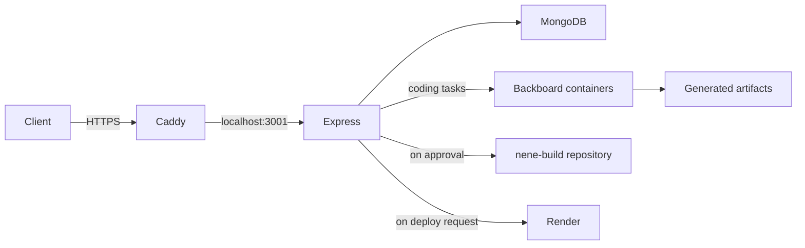

# nene-backend

Backend source and deployment setup imported from `nene@165.245.234.34`.
The TypeScript source, package files, and compiler configuration are copied
unchanged from `/home/nene/ne-ne/backend`. The import did not edit VM files,
restart services, or deploy changes.

## What the backend does

An Express API runs Backboard coding tasks inside disposable Docker containers,
stores task state and events in MongoDB, and streams progress to clients using
server-sent events. Approving a completed build publishes its artifact to
`DoanGiaHuyVu/nene-build`; a separate request deploys it to Render.
Continuations reuse a previous project artifact and its GitHub branch.



## Files

| Path | Purpose |
| --- | --- |
| `src/server.ts` | HTTP API, authentication, task execution, event streaming, deployment orchestration |
| `src/db.ts` | MongoDB task/event persistence and indexes |
| `src/progress.ts` | Progress inferred from Backboard events |
| `src/github.ts` | Publishes generated artifacts to GitHub |
| `src/render.ts` | Render service and deployment API calls |
| `src/test-mongodb.ts` | Database connectivity check |
| `agent-image/` | Agent Dockerfile, entrypoint, and provider configuration |
| `deploy/systemd/nene-backend.service` | Existing VM backend service definition |
| `deploy/caddy/Caddyfile` | Existing VM HTTPS proxy configuration |
| `publish.gitignore` | Ignore rules used when publishing generated projects |
| `.env.example` | Environment variable template with placeholders |

## Edit and build on this Mac

```sh
cd /Users/adamvu/nene-backend
npm ci
npm run build
```

Edit the files in `src/`. Local edits do not change the running VM.
The original application uses hardcoded Linux paths, so this checkout is
intended for editing and compilation on macOS. Running the complete backend
requires the Linux directory layout, Docker agent image, credentials, MongoDB,
and GitHub SSH access described below.

`npm run dev` starts the TypeScript watcher; `npm start` runs `dist/server.js`.
Both require environment variables to have been loaded before startup.

## Existing VM setup

The observed VM uses Ubuntu 24.04.5 LTS on x86_64, Node.js `22.23.3`,
npm `10.9.9`, and Docker `29.1.3`. The backend, Caddy, and Docker services
were active during inspection.

| VM location | Purpose / repository equivalent |
| --- | --- |
| `/home/nene/ne-ne/backend` | Backend checkout: repository root |
| `/home/nene/ne-ne/agent-image` | Files from `agent-image/`, plus the Backboard executable |
| `/home/nene/ne-ne/publish.gitignore` | Repository's `publish.gitignore` |
| `/home/nene/ne-ne/artifacts` | Generated project artifacts; runtime data |
| `/home/nene/.config/ne-ne/backend.env` | Private environment file; use `.env.example` as a template |
| `/home/nene/.ssh/nene_github` | Private SSH identity for publishing generated projects |
| `/etc/systemd/system/nene-backend.service` | `deploy/systemd/nene-backend.service` |
| `/etc/caddy/Caddyfile` | `deploy/caddy/Caddyfile` |

The systemd service runs as `nene` with the supplementary `docker` group,
loads the private environment file, starts the compiled server, and restarts
it on exit. Express listens on `127.0.0.1:3001`. Caddy proxies HTTPS from
`165-245-234-34.sslip.io` to that address.

To recreate the deployment on another Linux host, prepare the same directories
and user permissions, install Node.js, Docker, and Caddy, and build the backend.
Place the agent files and `publish.gitignore` at their paths in the table.
Follow [the agent image instructions](agent-image/README.md) to supply the
Backboard executable and build `nene-agent:0.2`. Supply private credentials and
a GitHub SSH key authorized for `DoanGiaHuyVu/nene-build`. Install the service
and Caddy configuration, adjusting the hostname for the new host, before
starting the services. These deployment actions were not performed during import.

Required startup variables are `DO_MODEL_KEY`, `MONGODB_URI`, and
`NENE_API_TOKEN`. Render deployment additionally needs `RENDER_API_KEY` and
`RENDER_OWNER_ID`; `RENDER_REGION` defaults to `oregon`.
The source selects the MongoDB database `nene` and creates unique task/event indexes.

## HTTP API

All routes except `/health` require `Authorization: Bearer <NENE_API_TOKEN>`.

| Method | Route | Purpose |
| --- | --- | --- |
| GET | `/health` | Health response |
| POST | `/tasks` | Create a task with a JSON `prompt` |
| POST | `/tasks/:id/continue` | Continue a completed task with a new `prompt` |
| GET | `/tasks/:id` | Retrieve task state |
| GET | `/tasks/:id/events` | Stream/replay task events |
| POST | `/tasks/:id/approve` | Publish a generated artifact to GitHub |
| POST | `/tasks/:id/deploy` | Deploy an approved project to Render |

## Import boundaries

Production credentials, private keys, logs, MongoDB contents, task workspaces,
generated artifacts, installed dependencies, compiled output, and old source
backups are excluded. The large Backboard executable is an external dependency
documented in `agent-image/README.md`. Existing application behavior and
VM-specific paths are preserved for later editing.
