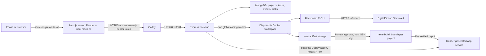

# ne-ne backend

ne-ne builds and updates applications from a browser or phone while the user's laptop is off. This Express/TypeScript service runs Backboard R-CLI in disposable Docker containers, uses DigitalOcean Inference for `gemma-4-31B-it`, persists state in MongoDB, and streams progress over server-sent events (SSE). A person reviews and approves a build before the backend publishes it to GitHub. Deploy is a separate action that hosts the generated application on Render.

The companion frontend is [nene-web](https://github.com/DoanGiaHuyVu/nene-web). This guide covers backend development, a complete first deployment on a new Linux host, and operation of the existing VM.

## Choose your setup

| Goal | Start here | Requirements |
| --- | --- | --- |
| Run the interface against the existing VM | [Frontend README](https://github.com/DoanGiaHuyVu/nene-web#readme) | Git, Node 22, npm, backend URL and privately supplied API token |
| Edit, compile and test backend code on your machine | [Local development](#local-development) | Git, Node 22 and npm; no production credentials for unit tests |
| Run build → approval → deployment on your own infrastructure | [New Linux host](#new-linux-host-from-start-to-finish) | Ubuntu x86_64, Docker, Backboard binary, MongoDB replica set, DigitalOcean model key, GitHub write deploy key, Render account |

Commands identify where they run. Replace `YOUR_VM_IP` and `YOUR_BACKEND_HOST` with your own values. Stop and fix any failed step before continuing. The new-host instructions are for a fresh host; do not reinstall over the existing production VM.

## Architecture and lifecycle



1. Submit a prompt. The API persists a run, reserves the worker and launches a sandbox asynchronously.
2. Backboard writes the deployable project to `/workspace/app` and is instructed to run suitable build/test/lint checks. Progress labels are inferred from events; the Testing label alone does not prove all checks passed.
3. On success, the backend extracts the artifact, removes the container/volume and sets `waiting_for_approval`.
4. View Changes compares `app/` with the run's recorded approved source. Approve publishes source and records `completed` after publication succeeds.
5. Deploy creates the project's Render service. Approved updates reuse its branch and service. The previous live version stays canonical until Render reports the new deployment `live`.
6. Continuation loads the project's latest approved successful artifact, including when the selected historical run failed. That artifact must still exist on disk.

The model runs through an external API, not on the 1 GB VM. GitHub keys, Render keys, MongoDB credentials and the backend token stay on the host. Only `DO_MODEL_KEY` reaches the coding container. One coding worker is admitted globally; there is no task queue. Busy workers return HTTP 409, and pending approval also locks that project.

## Repository and runtime structure

```text
nene-backend/
├── src/
│   ├── server.ts             # environment checks, startup/recovery, shutdown
│   ├── app.ts                # authenticated HTTP API and bounded SSE
│   ├── backend.ts            # project/run, approval and deployment orchestration
│   ├── model.ts              # types, validation and state transitions
│   ├── runner.ts             # Docker execution, artifacts and cleanup
│   ├── changes.ts            # bounded artifact comparisons for review
│   ├── db.ts                 # collections, indexes and transactions
│   ├── progress.ts           # Backboard events → user-facing progress
│   ├── github.ts             # host-side publication/reconciliation
│   ├── render.ts             # Render service/deploy APIs and reconciliation
│   ├── instrument.ts         # optional Sentry initialization before Express
│   ├── telemetry.ts          # bounded agent and lifecycle tracing
│   ├── telemetry-privacy.ts  # telemetry sanitization
│   └── test-mongodb.ts       # connection ping, not a transaction test
├── agent-image/              # Dockerfile, entrypoint and provider config
├── deploy/
│   ├── systemd/nene-backend.service
│   ├── caddy/Caddyfile
│   ├── SAFETY-CLEANUP.md      # rollout, resource limits and recovery
│   └── VIEW-CHANGES.md        # review endpoint rollout notes
├── docs/SENTRY-AGENT-TRACING.md
├── scripts/                  # optional Sentry smoke/fixture/history tools
├── test/                     # Node test runner suites
├── .env.example              # placeholder configuration
├── publish.gitignore         # generated-source publication exclusions
├── package.json
└── package-lock.json
```

The Linux runtime places support files **alongside** the backend checkout:

```text
/home/nene/ne-ne/
├── backend/                  # this repository, node_modules/ and dist/
├── agent-image/              # copied agent files plus external backboard binary
├── publish.gitignore
└── artifacts/<run-UUID>/app/  # persistent generated source

/home/nene/.config/ne-ne/backend.env  # private host configuration
/home/nene/.ssh/nene_github           # private publishing key
/etc/systemd/system/nene-backend.service
/etc/caddy/Caddyfile
```

`workspaces/`, `alive.log`, backups and release directories on the original VM are historical/operator files, not prerequisites for the current runner. Dependencies, compiled output, secrets, artifacts and the Backboard executable are excluded from Git.

## Local development

### 1. Install Git and Node 22

On macOS, run `xcode-select --install` if Git is missing. On Ubuntu install `git curl ca-certificates`. On Windows install Git and Node 22 with their installers, or use WSL2 Ubuntu for these shell commands.

Select Node 22 from [Node.js downloads](https://nodejs.org/en/download), or install [nvm](https://github.com/nvm-sh/nvm#installing-and-updating) on macOS/Linux:

```sh
curl -fsSL https://raw.githubusercontent.com/nvm-sh/nvm/v0.40.8/install.sh -o /tmp/nene-nvm-install.sh
bash /tmp/nene-nvm-install.sh
. "$HOME/.nvm/nvm.sh"
nvm install 22
nvm use 22
git --version
node --version
npm --version
```

The observed VM uses Node `22.23.3`, npm `10.9.9`. Use Node 22 for both repositories; the frontend requires `22.x`. Reopen your terminal if nvm is unavailable. No global TypeScript, Express, MongoDB driver or Next.js installation is needed.

### 2. Clone, install and test

On your machine:

```sh
mkdir -p ~/nene
cd ~/nene
git clone https://github.com/DoanGiaHuyVu/nene-backend.git
cd nene-backend
npm ci
npm test
```

`npm ci` installs the committed dependencies. `npm test` compiles into `dist/` and runs the existing suites. The real MongoDB transaction test is skipped unless `NENE_TEST_MONGODB_URI` is supplied. Other suites use isolated/fake integrations and do not invoke the paid model or publish/deploy a project.

For the optional transaction test, use a test account able to create/drop `nene_test_<UUID>` databases on a replica set. The test removes its own generated database. Do not connect a development server to production MongoDB: startup performs migration, recovery and maintenance against the selected `nene` database.

### 3. Starting a development server

Edit `src/` and run `npm run build`. Local edits do not update the VM. `npm run dev` starts the TypeScript watcher; `npm start` runs compiled output. Neither automatically loads a backend `.env` file.

After preparing an isolated Linux runtime with the next section:

```sh
cd /home/nene/ne-ne/backend
set -a
. /home/nene/.config/ne-ne/backend.env
set +a
npm run dev
```

Source only a trusted file you created with shell-compatible `KEY=value` entries. Do not run this alongside systemd on the same port/database. Ctrl+C stops the watcher.

`NENE_ROOT` and `NENE_PORT` relocate the runtime root and localhost port. Copy `agent-image/` under that root and set `NENE_PUBLISH_IGNORE` if needed. The publishing key remains fixed at `/home/nene/.ssh/nene_github`; macOS with Docker Desktop is not a verified full approval/deployment environment. The supported complete setup below uses Linux x86_64. Editing, compiling and unit testing on a Mac do not require Docker.

## New Linux host from start to finish

### 1. Create the VM and non-root account

On your machine, use an existing SSH key or create one:

```sh
ssh-keygen -t ed25519 -C "nene-vm-access"
cat ~/.ssh/id_ed25519.pub
```

Upload only the public `.pub` key. Create an Ubuntu 24.04 LTS x86_64 VM, select that key, and note its IPv4 address. The existing deployment has 1 vCPU, about 1 GB RAM, 25 GB disk and 2 GB swap. More RAM provides headroom; current code still admits one worker. Check current provider plans instead of relying on historical prices. See [DigitalOcean SSH setup](https://docs.digitalocean.com/products/droplets/how-to/add-ssh-keys/).

From your machine, run `ssh root@YOUR_VM_IP`. Verify the host fingerprint with the provider console before trusting it. On the **new VM as root**:

```sh
apt update
apt upgrade -y
apt install -y git curl jq ca-certificates ripgrep unzip xz-utils gnupg openssl nano
adduser nene
usermod -aG sudo nene
install -d -m 700 -o nene -g nene /home/nene/.ssh
install -m 600 -o nene -g nene /root/.ssh/authorized_keys /home/nene/.ssh/authorized_keys
```

Keep root connected until a second terminal can run `ssh nene@YOUR_VM_IP` and `sudo whoami` successfully. The latter should print `root`. Run remaining VM commands as **nene**, with sudo where shown.

### 2. Install system-wide Node 22

systemd does not load nvm or `.bashrc`. On a fresh x86_64 host, install the observed Node release from the [official archive](https://nodejs.org/dist/v22.23.3/):

```sh
mkdir -p ~/nene-install/node
cd ~/nene-install/node
curl -fSLO https://nodejs.org/dist/v22.23.3/node-v22.23.3-linux-x64.tar.xz
curl -fSLO https://nodejs.org/dist/v22.23.3/SHASUMS256.txt
rg ' node-v22\.23\.3-linux-x64\.tar\.xz$' SHASUMS256.txt | sha256sum -c -
```

Continue only if the checksum reports `OK`:

```sh
sudo tar -xJf node-v22.23.3-linux-x64.tar.xz -C /opt
sudo ln -s /opt/node-v22.23.3-linux-x64/bin/node /usr/bin/node
sudo ln -s /opt/node-v22.23.3-linux-x64/bin/npm /usr/bin/npm
sudo ln -s /opt/node-v22.23.3-linux-x64/bin/npx /usr/bin/npx
/usr/bin/node --version
npm --version
```

These commands assume Node/npm are absent. If installed, verify versions/paths instead of overwriting them. For later upgrades select a maintained Node 22 patch release and update archive/paths together.

### 3. Install Docker and prepare memory

The existing VM uses Ubuntu's `docker.io` package. On a fresh Ubuntu host:

```sh
sudo apt update
sudo apt install -y docker.io
sudo systemctl enable --now docker
sudo usermod -aG docker nene
```

Log out and reconnect for the group change, then run `docker info` and `docker run --rm hello-world` without sudo. Docker group membership grants powerful host access; restrict it to the operator account. [Ubuntu's package](https://packages.ubuntu.com/noble/docker.io) matches the observed installation. [Docker's official repository](https://docs.docker.com/engine/install/ubuntu/) is an alternative; do not mix package families.

Check `free -h`, `swapon --show` and `df -h /home/nene`. On a fresh 1 GB host **without existing swap or `/swapfile`**, add the observed 2 GB swap:

```sh
sudo fallocate -l 2G /swapfile
sudo chmod 600 /swapfile
sudo mkswap /swapfile
sudo swapon /swapfile
printf '/swapfile none swap sw 0 0\n' | sudo tee -a /etc/fstab
swapon --show
```

Do not repeat this on an existing swap setup. New work needs at least 2 GB free disk. Agent/seeding containers use 512 MB RAM, 640 MB RAM+swap, 0.75 CPU, 128 processes, a read-only root filesystem, dropped capabilities and no new privileges. HOME and temporary files are inside writable `/workspace`.

### 4. Clone and place support files

On the VM:

```sh
mkdir -p /home/nene/ne-ne
cd /home/nene/ne-ne
git clone https://github.com/DoanGiaHuyVu/nene-backend.git backend
cd backend
npm ci
npm test
mkdir -p ../agent-image ../artifacts
cp agent-image/Dockerfile agent-image/entrypoint.sh agent-image/backboard-config.json ../agent-image/
cp publish.gitignore ../publish.gitignore
```

### 5. Supply Backboard and build the image

The executable is external and not included in Git. With authorized SSH access to the original VM, copy it to the **new VM**:

```sh
scp nene@165.245.234.34:/home/nene/ne-ne/agent-image/backboard /home/nene/ne-ne/agent-image/backboard
chmod +x /home/nene/ne-ne/agent-image/backboard
sha256sum /home/nene/ne-ne/agent-image/backboard
```

The new VM needs an SSH identity authorized on the original host. Alternatively copy the binary to your machine, then transfer it to the new host. Never transfer the original VM's private publishing key.

Expected SHA-256: `3e3faba6e31fecd988ed21ec35b7402a54218e1e3f4648c61597795b6807b7c2`.

Without access to that binary, follow [agent-image/README.md](agent-image/README.md) to build from the recorded Backboard source commit. Bun is needed only for this alternative. Rebuilt output is not guaranteed byte-identical.

After verifying the binary, on the VM:

```sh
cd /home/nene/ne-ne
docker build --platform linux/amd64 -t nene-agent:0.3 agent-image
docker run --rm nene-agent:0.3 --version
```

Expected Backboard version: `3.0.4`. The runner selects `nene-agent:0.3`; building only `0.2` is insufficient. The provider file already configures DigitalOcean/OpenAI Chat Completions, `https://inference.do-ai.run/v1`, `gemma-4-31B-it`, and environment authentication using `DO_MODEL_KEY`. Per-container interactive `/providers` setup is unnecessary.

### 6. Configure MongoDB and model access

Create an Atlas project/cluster and a database user with read/write access to `nene`. Add the VM's egress IP to Atlas Network Access. Copy the actual Node driver connection string and URL-encode special characters in its username/password. See [Atlas setup](https://www.mongodb.com/docs/get-started/).

MongoDB must support multi-document transactions: use Atlas or an initialized replica set, not a standalone MongoDB container. A ping alone does not verify transaction support. The backend explicitly selects database `nene`, creating `tasks`, `events`, `projects`, `locks` and indexes. See [MongoDB transactions](https://www.mongodb.com/docs/manual/core/transactions/).

Create a DigitalOcean model access key scoped to the configured model, enable inference access/billing, and store it as `DO_MODEL_KEY`. This is a model key, not a Droplet administration token. Check model availability with the discovery request in step 8. See [DigitalOcean inference/model access](https://docs.digitalocean.com/products/inference/how-to/use-serverless-inference/).

### 7. Configure GitHub publication and Render

Generated apps currently publish to `DoanGiaHuyVu/nene-build`. Obtain permission to configure that repository, or create your own output repository. Backend/frontend source repositories are separate from generated source.

On the VM, generate a **new** dedicated publishing key; leave its passphrase empty for unattended operation:

```sh
ssh-keygen -t ed25519 -f /home/nene/.ssh/nene_github -C "nene-generated-builds"
chmod 600 /home/nene/.ssh/nene_github
cat /home/nene/.ssh/nene_github.pub
```

Do not overwrite an existing key. Add the public key under the output repository's Settings → Deploy keys with **Allow write access**. Verify the SSH host against [GitHub's fingerprints](https://docs.github.com/en/authentication/keeping-your-account-and-data-secure/githubs-ssh-key-fingerprints), then establish host trust with:

```sh
ssh -i /home/nene/.ssh/nene_github -o IdentitiesOnly=yes -T git@github.com
GIT_SSH_COMMAND='ssh -i /home/nene/.ssh/nene_github -o IdentitiesOnly=yes' \
  git ls-remote git@github.com:DoanGiaHuyVu/nene-build.git
```

GitHub's successful authentication message may return exit status 1; `git ls-remote` should succeed. This tests read access; write-enabled key configuration and the later approval verify publication. See [deploy keys](https://docs.github.com/en/authentication/connecting-to-github-with-ssh/managing-deploy-keys).

For Deploy, create a Render API key and obtain your owner/workspace ID (`tea-...` or `usr-...`) from the account/API. Set `RENDER_API_KEY` and `RENDER_OWNER_ID`. Grant Render repository access if the output repository is private. Code requests Docker web services with plan `free`, region `oregon` by default, root `app`, Dockerfile `./Dockerfile`, and auto-deploy off. Confirm account/plan availability before testing.

For an independent output repository, set `NENE_GITHUB_REPO` and `NENE_GITHUB_WEB_REPO` **and update the hardcoded repository in `src/render.ts` before building**. Publication environment overrides alone do not redirect Render.

### 8. Store credentials and check connections

On the VM:

```sh
mkdir -p /home/nene/.config/ne-ne
chmod 700 /home/nene/.config/ne-ne
cp /home/nene/ne-ne/backend/.env.example /home/nene/.config/ne-ne/backend.env
chmod 600 /home/nene/.config/ne-ne/backend.env
nano /home/nene/.config/ne-ne/backend.env
```

Replace required placeholders. Generate an API token with `openssl rand -hex 32`, paste it into the private file and privately provide the same value to the frontend operator. Never commit it or prefix it with `NEXT_PUBLIC_`.

| Variable | Requirement / default |
| --- | --- |
| `DO_MODEL_KEY` | Required at startup; coding-container model credential |
| `MONGODB_URI` | Required at startup; transaction-capable MongoDB connection |
| `NENE_API_TOKEN` | Required at startup; shared with the Next.js server only |
| `RENDER_API_KEY`, `RENDER_OWNER_ID` | Required for generated-app deployment |
| `RENDER_REGION` | Optional; `oregon` |
| `NENE_ROOT` | Optional; `/home/nene/ne-ne` |
| `NENE_PORT` | Optional; `3001`, bound to `127.0.0.1` |
| `NENE_PUBLISH_IGNORE` | Optional; `/home/nene/ne-ne/publish.gitignore` |
| `NENE_GITHUB_REPO`, `NENE_GITHUB_WEB_REPO` | Optional publication overrides; Render target separately hardcoded |
| `SENTRY_DSN` | Optional; empty disables telemetry |
| `SENTRY_ENVIRONMENT`, `SENTRY_RELEASE`, `SENTRY_TRACES_SAMPLE_RATE` | Optional telemetry labels/rate (0–1) |
| `SENTRY_MODEL_*` | Optional cost estimate settings; see telemetry guide |

Leave Sentry DSN empty until supplying your project DSN. Runtime telemetry needs no Sentry API auth token. See [Sentry setup/privacy](docs/SENTRY-AGENT-TRACING.md).

Load the trusted file in this shell and check connectivity:

```sh
cd /home/nene/ne-ne/backend
set -a
. /home/nene/.config/ne-ne/backend.env
set +a
node dist/test-mongodb.js
curl -fsS -H "Authorization: Bearer $DO_MODEL_KEY" https://inference.do-ai.run/v1/models \
  | jq -r '.data[].id' | rg '^gemma-4-31B-it$'
```

Expected: MongoDB connected and the configured model ID returned. Do not print the environment file or use `set -x` with credentials loaded.

### 9. Run under systemd

On the VM:

```sh
cd /home/nene/ne-ne/backend
npm run build
sudo install -m 644 deploy/systemd/nene-backend.service /etc/systemd/system/nene-backend.service
sudo systemctl daemon-reload
sudo systemctl enable --now nene-backend
systemctl is-active nene-backend
curl -fsS http://127.0.0.1:3001/health
ss -ltn | rg '127\.0\.0\.1:3001'
```

Expected: `active`, `{"ok":true,"service":"ne-ne"}`, and localhost port 3001. The unit uses `/usr/bin/node`, user `nene`, the Docker group, the private environment file and explicit Sentry preload. Adjust paths consistently for a different layout. The server runs after SSH disconnects; do not bind it directly to public `0.0.0.0:3001`.

### 10. Add HTTPS

Point a DNS A record for `YOUR_BACKEND_HOST` at the VM. A demo can use `YOUR_IP_WITH_DASHES.sslip.io`; the existing hostname `165-245-234-34.sslip.io` points to the original VM, not your new host. Allow inbound SSH 22 and HTTP/HTTPS 80/443 in provider/host firewalls. Allow outbound DNS, HTTPS, MongoDB and GitHub SSH; port 3001 stays private.

Install Caddy using its [official Ubuntu instructions](https://caddyserver.com/docs/install#debian-ubuntu-raspbian):

```sh
sudo apt install -y debian-keyring debian-archive-keyring apt-transport-https curl
curl -1sLf https://dl.cloudsmith.io/public/caddy/stable/gpg.key \
  | sudo gpg --dearmor -o /usr/share/keyrings/caddy-stable-archive-keyring.gpg
curl -1sLf https://dl.cloudsmith.io/public/caddy/stable/debian.deb.txt \
  | sudo tee /etc/apt/sources.list.d/caddy-stable.list
sudo chmod o+r /usr/share/keyrings/caddy-stable-archive-keyring.gpg /etc/apt/sources.list.d/caddy-stable.list
sudo apt update
sudo apt install -y caddy
sudo nano /etc/caddy/Caddyfile
```

Replace the Caddyfile with your hostname:

```caddyfile
YOUR_BACKEND_HOST {
    reverse_proxy 127.0.0.1:3001
}
```

Then:

```sh
sudo caddy validate --config /etc/caddy/Caddyfile --adapter caddyfile
sudo systemctl enable --now caddy
sudo systemctl reload caddy
curl -fsS https://YOUR_BACKEND_HOST/health
curl -i https://YOUR_BACKEND_HOST/tasks/00000000-0000-4000-8000-000000000000
curl -i -H "Authorization: Bearer $NENE_API_TOKEN" \
  https://YOUR_BACKEND_HOST/tasks/00000000-0000-4000-8000-000000000000
```

Expected: public health 200, protected request without token 401, authenticated synthetic lookup 404 `Task not found`. This verifies authentication without starting work. Use a valid UUID; `/tasks/not-real` now returns 400 after authentication.

### 11. Connect the frontend and verify the full workflow

Follow the [frontend README](https://github.com/DoanGiaHuyVu/nene-web#readme). Configure `NENE_BACKEND_URL=https://YOUR_BACKEND_HOST` with **no trailing slash**, and matching `NENE_API_TOKEN` in private `.env.local`/hosting settings. The browser calls Next.js `/api/tasks`; Next.js adds the host token.

After read-only checks pass, submit a small app prompt. This uses paid inference and creates an artifact. Review View Changes, Approve to publish, then Deploy to create a Render service. Verify View Code, Open App and a follow-up that reuses the branch/service. The frontend guide contains the acceptance checklist.

Generated apps need `app/Dockerfile`, a production startup command, binding to `0.0.0.0`, and `PORT` support (default 10000). Those are generated-app requirements; this backend remains localhost-only. Publication excludes dependencies, caches, environment files and runtime junk. Deploy requires an approved/published current revision.

## HTTP API

All routes except `/health` require `Authorization: Bearer <NENE_API_TOKEN>`. Frontend equivalents add `/api` and authenticate server-side.

| Method | Route | Behavior |
| --- | --- | --- |
| GET | `/health` | Public process health, not a full integration diagnostic |
| POST | `/tasks` | JSON `{ "prompt": "..." }`; async acceptance with 202 |
| POST | `/tasks/:id/continue` | New prompt; latest approved project source, 202 |
| GET | `/tasks/:id` | Persisted run state |
| GET | `/tasks/:id/events` | Replay/live SSE; direct clients may send numeric `Last-Event-ID` |
| GET | `/tasks/:id/changes` | Bounded app diff when ready for approval or published |
| POST | `/tasks/:id/approve` | Publish to GitHub, then complete; retries reconcile publication |
| POST | `/tasks/:id/deploy` | Create/update project's Render service; 202 pending, 200 already live |

Task status: `queued → running → waiting_for_approval → completed`, with `failed`/`interrupted` alternatives. Deployment separately follows `creating → building → live` or `failed`. There is no all-projects/tasks listing API, user account system or cancellation endpoint. Conversation lists are browser-local even though project ownership is persisted on the backend.

## Existing deployment and audit

Read-only inspection on **October 5, 2026** confirmed:

| Item | Observed value |
| --- | --- |
| VM | `nene@165.245.234.34`, `ne-ne-vm`, Ubuntu 24.04.5 LTS, x86_64 |
| Runtime | Node `22.23.3`, npm `10.9.9`, Ubuntu Docker `29.1.3`, Caddy `2.11.7` |
| Services | Backend, Docker, Caddy active; backend on `127.0.0.1:3001` |
| Agent | `nene-agent:0.3`, Linux amd64; Backboard source commit `960c430754f42823b4153ad6a5cd2ccadd5641e5` |
| Memory | About 1 GB RAM, 2 GB swap |
| HTTPS | `https://165-245-234-34.sslip.io`; health 200, no-token task 401, authenticated synthetic lookup 404 |
| MongoDB | Replica set; `nene` has `tasks`, `events`, `projects`, `locks` |
| Frontend | `https://nene-5yh0.onrender.com`; Render Node web service, Oregon, `nene-web` root, `main`, auto-deploy on commit; page/proxy returned 200/404 |
| Source | SHA-256 matches for all VM `src/*.ts`, package files, agent configuration and publishing ignore file |

The original VM backend is a deployed directory **without `.git`**. Pushing this repository does not update it. Its installed service uses plain `node dist/server.js`, with `NODE_OPTIONS='--import /home/nene/ne-ne/backend/dist/instrument.js'` in the private environment. The new-host unit uses explicit `--import`. Both preload before Express; preserve this when using older service definitions.

The observed frontend build command is `npm install; npm run build`, start command `npm run start`. The frontend guide recommends `npm ci && npm run build` for new setups. This audit did not restart production or launch a paid task/deployment.

## Updating and recovery

Build/test changes in a checkout first. On hosts installed by this guide, inspect `git status`, back up source/compiled output/configuration, then `git pull --ff-only`, `npm ci` and `npm test`. For the original VM without `.git`, transfer a reviewed release's source/package files/compiled output using the existing release procedure. Do not run `git pull` there or overwrite private environment/artifact directories.

Before a planned restart, check that no `nene-task-*` or `nene-seed-*` container is running. Changes to agent files require copying them to the sibling `agent-image/` and rebuilding `nene-agent:0.3`; repository edits alone do not update the runtime image. Update the sibling publishing ignore file when it changes. Installing a changed systemd unit also requires `sudo systemctl daemon-reload`.

An administrator can restart and inspect:

```sh
sudo systemctl restart nene-backend
systemctl is-active nene-backend
sudo journalctl -u nene-backend -n 100 --no-pager
curl -fsS http://127.0.0.1:3001/health
```

The original `nene` account requires a sudo password. Keep logs/configuration private. Repeat public/authenticated read-only checks; retain a working release/image for rollback. Rolling back source does not undo database changes.

Startup migrates old task chains into projects, reconciles existing containers, marks lost work interrupted, clears stale locks and resumes pending Render monitoring. It does not guarantee relaunch of an arbitrary killed coding process. There is no fixed coding execution timeout or Render deployment deadline. Ambiguous Render requests can remain pending for operator reconciliation; blindly creating another service can duplicate a deployment.

Back up **MongoDB and approved/pending artifacts**, plus protected configuration and publishing keys. MongoDB alone cannot restore source files needed for continuation. Cleanup removes eligible failed/interrupted artifacts after seven days and stale app-owned temporary clones after 24 hours; approved/pending artifacts remain. Avoid global Docker pruning. See [rollout/recovery notes](deploy/SAFETY-CLEANUP.md).

## Troubleshooting

| Symptom | Check / fix |
| --- | --- |
| Required variable missing | Dev shell environment or systemd `EnvironmentFile`; backend does not auto-load `.env` |
| MongoDB DNS/auth/selection failure | Actual Atlas hostname, encoded password, privileges, VM allowlist, outbound connectivity |
| Transaction/replica-set error | Atlas or initialized replica set; standalone MongoDB is insufficient |
| Docker permission denied | Docker active, correct group, reconnect after group changes |
| Missing image / executable format error | Build `nene-agent:0.3`; Linux x86_64 binary and verified checksum |
| 401 | Matching backend/Next.js token; restart/redeploy after configuration changes |
| 400 from `/tasks/not-real` | UUID validation; use valid synthetic UUID |
| 409 on start/continue | Worker busy, pending approval, missing approved artifact; read the actual response |
| 507 | At least 2 GB free disk; inspect retained artifacts/owned resources |
| Approval failure | SSH key path, write deploy key, host trust, repository access, retained artifact and unchanged approved branch |
| Deploy failure | Render key/owner/repository access/plan/region; app Dockerfile, binding and Render build logs |
| HTTPS failure | DNS, ports 80/443, Caddy validation/logs, local backend health |
| View Changes failure | Backend endpoint installed first; source artifact and recorded baseline available |

## Corrections to the process documents

The seven `nene process*.docx` files describe successive stages. They are historical evidence, not commands to execute verbatim. Current code and the inspected deployment take precedence.

| Historical statement/command | Current correction |
| --- | --- |
| Agent `0.2`, 700 MB RAM, 0.85 CPU, separate `/tmp` tmpfs | `0.3`, 512 MB / 640 MB with swap, 0.75 CPU; HOME/temp under `/workspace` |
| Four routes; approval only changes state | Continuation, changes and deployment exist; approval publishes first |
| Final task status `approved` | `completed`; approval/publication metadata is separate |
| In-memory map; only tasks/events | MongoDB authoritative; projects/locks enforce transactional ownership |
| New branch/service for every task | Initial project gets `task/<first-8-characters>`; updates extend branch and reuse service |
| No active-worker recovery | Existing container recovery; lost work interrupted; deployment monitoring resumes |
| Every Linux path hardcoded | Root/port/publication overrides exist; SSH key and Render repository still fixed |
| `echo 'export PATH="PATH"'` | Broken PATH. Optional developer CLI needs `export PATH="$HOME/.local/bin:$PATH"` |
| Malformed `PUBLIC_IP=(...)` | After setting IP, use `NENE_HOST="$(printf '%s' "$NENE_VM_IP" | tr '.' '-').sslip.io"` |
| Deploy disabled / frontend still pending | Deployment and changes review implemented; hosted frontend/proxy verified |
| Create a fresh template / install packages manually | Clone existing repositories; use committed lockfiles with `npm ci` |
| Old prices, versions and test IDs | Use current provider plans, observed versions above, and newly created task IDs |

The current frontend is a mobile-friendly web app. The process notes call it a PWA, but this checkout has no manifest/service worker or verified offline installation support. Temporal is not part of the running backend.

Documentation verification on October 5, 2026 used Node 22.23.3: the backend build and 30 tests passed; the optional real MongoDB transaction test was skipped locally. Frontend tests/lint and the webpack production build passed. Shell examples were checked for Bash syntax, and local documentation links were checked for existence. The VM inspection verified source/compiled hashes and read-only connectivity; a fresh VM and new paid model/GitHub/Render workflow were not provisioned during this documentation update.
