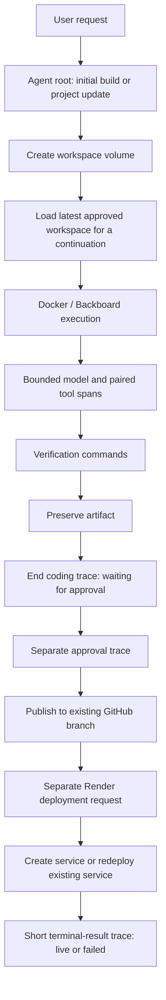
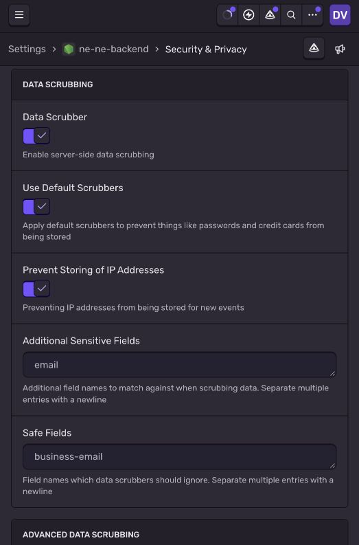
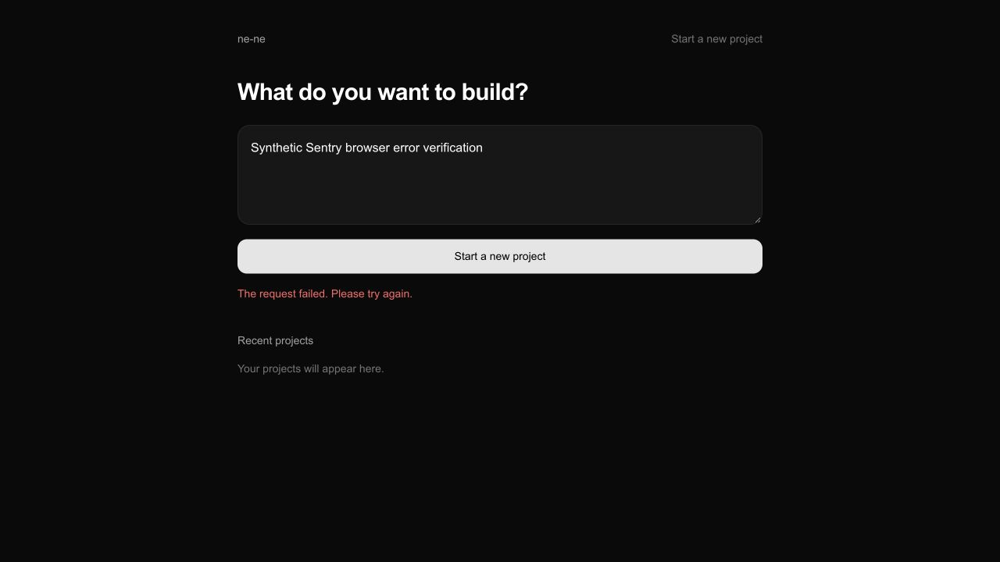
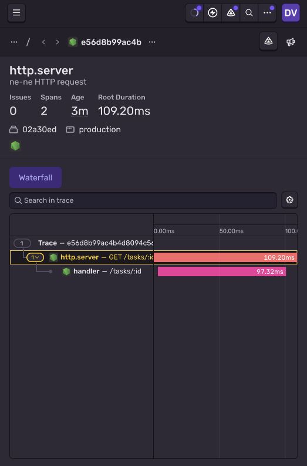
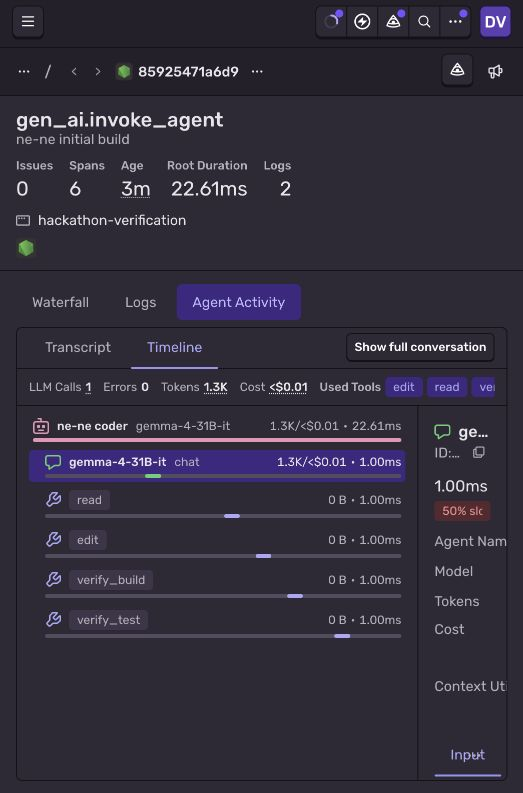

# ne-ne: showing a persistent coding agent's work with Sentry

ne-ne turns a conversation into a working application, then updates that same application across follow-ups. Sentry makes the coding run inspectable: what the agent did, where it spent time, how much observed model usage accumulated, which verification commands succeeded, and where a failure occurred. Approval, GitHub publication, and Render deployment are short, separately correlated operations, so a person can approve hours later without retaining a tracing object in memory.

## Setup and deployment status

The backend uses `@sentry/node` **11.4.0** with Node **22.23.3** on the DigitalOcean VM. The frontend uses `@sentry/nextjs` **11.4.0** with Next **16.3.8**. The existing Docker sandbox still uses Backboard R-CLI and DigitalOcean Inference's `gemma-4-31B-it`. One coding worker is allowed globally; its container remains limited to 512 MB RAM and 0.75 CPU on the 1 vCPU / 1 GB host.

The runtime needs a project DSN, not a Sentry API auth token. The DSN lives in the VM's existing mode-600 `/home/nene/.config/ne-ne/backend.env`. The supplied wizard run code is not embedded in application code, environment tags, or evidence. No collector or additional persistent service is installed.

The VM setup event was accepted with HTTP 200 and confirmed in the [Sentry setup issue](https://concordia-university-00.sentry.io/issues/7773295769/?project=4512201298935808): event `6ff37dc16928420e92d406a45d67f611`.

**Activation:** the tested update is installed and hash-verified on the VM. After the user's explicit restart approval, systemd started production PID **50178** at **2026-10-05 03:35:49 UTC** with release `nene-backend@02a30ed`, environment `production`, sampling rate `1`, and the Sentry preload configured. Local and public health checks returned HTTP **200**, and an authenticated read-only task request also returned **200**. No coding worker was running during activation. A rollback archive is saved at `/home/nene/ne-ne/backend-backups/sentry-20261004.tgz`, and the original protected environment file is backed up with mode 600. The production service preloads the SDK through `NODE_OPTIONS='--import /home/nene/ne-ne/backend/dist/instrument.js'` in its existing protected environment file. This works with its existing systemd `ExecStart`, without needing a root-owned service edit. The repository's systemd template and `npm start` also use explicit `--import`. Keep initialization before Express imports.

For an administrator, the conventional restart command is:

```sh
sudo systemctl restart nene-backend.service
systemctl is-active nene-backend.service
curl -fsS http://127.0.0.1:3001/health
```

The `nene` account has no passwordless sudo. Our established deployment procedure verifies the service's user, command and PID, then sends SIGTERM to that user-owned Node process; systemd's existing `Restart=always` policy starts the installed version. Do this only after approval and after checking that there is no coding worker in progress.

The frontend's private `.env.local` is configured locally. Its hosting environment must receive `SENTRY_DSN`, `NEXT_PUBLIC_SENTRY_DSN`, `SENTRY_ENVIRONMENT`, and `NEXT_PUBLIC_SENTRY_ENVIRONMENT` before redeployment. Browser DSNs are public ingestion addresses; API tokens stay server-only. The deployed frontend's hosting configuration has not been verified. Frontend source-map uploads and performance tracing are disabled in this bootstrap.

## Trace design



All workflow spans carry stable `nene.project.id`, `nene.run.id`, `nene.source_run.id` where applicable, and `gen_ai.conversation.id` equal to the project ID. A continuation and its initial build therefore belong to one AI conversation. Run type and progress are safe attributes. Approval and deployment remain independently timed traces; the human wait is recorded as `nene.approval.wait_ms`.

| Operation | Span operation | Useful evidence |
| --- | --- | --- |
| Initial build / continuation | `gen_ai.invoke_agent` | Agent name, model, IDs, run type, aggregate usage/tools/checks, duration, final status |
| Workspace volume / approved seed | `nene.workspace.create` / `nene.workspace.seed` | Duration, source run, artifact availability, failures |
| Docker / Backboard execution | `nene.agent.execute` / `nene.agent.recover` | Container identity, model, success or failure, successful exit code |
| Observed model operation | `gen_ai.chat` | Input/output/cached tokens, estimated USD, observed interval |
| Paired tool / verification | `gen_ai.execute_tool` | Finite category: read/write/edit/execute/other or verify_build/test/lint/typecheck/syntax; reported outcome |
| Artifact copy | `nene.artifact.preserve` | Duration and success/failure |
| Approval / GitHub publication | `nene.approval` / `nene.github.publish` | Human wait, stable branch, resulting commit, error location |
| Render create / redeploy | `nene.render.create` / `nene.render.redeploy` | Initial service versus existing service, service/deploy IDs, duration |
| Render terminal result | `nene.render.result` | Live/failed status and elapsed time since request, without an open polling span |

Sentry's [GenAI conventions](https://getsentry.github.io/sentry-conventions/attributes/gen_ai/) define `gen_ai.operation.type` as `agent`, `ai_client`, or `tool` for these operations. Model usage and tool metadata make the traces appear in Sentry's **Agent Activity** view. Prompts and model/tool output are intentionally absent.

## Performance and cost: interpret the numbers honestly

A model span measures an **observed interval**, bounded by the available turn/tool/stream/usage signals. Backboard does not expose exact provider request-start timestamps. This is not a measurement of provider-only latency, time to first token, or network time. The coding root and Docker execution duration measure the corresponding backend operations directly.

Usage events are aggregated as per-response observations. Cached tokens are included in input tokens and must not be added twice. For a known DigitalOcean Gemma response, the USD estimate is:

```text
((input - cached) × input_rate + cached × cache_read_rate
 + output × output_rate) / 1,000,000
```

The initial rates are $0.18 input, $0.50 output and $0.036 cache read per million tokens, based on [DigitalOcean's published pricing](https://docs.digitalocean.com/products/inference/details/pricing/), recorded on 2026-10-04. Environment variables can update the rate snapshot. This estimate excludes VM/Render costs and does not claim to reproduce an invoice. Unknown models are counted explicitly and are not assigned Gemma pricing. Invalid usage is counted rather than silently interpreted as zero.

**A source-level finding:** `OpenAIAdapter` attaches final-response usage to its `completed` event, while `ProviderStreamConsumer` does not emit that usage through the bus. Tool-round `usage` events do arrive. Consequently the recorded totals are **observed usage**, potentially lower than total billed usage. This integration labels that limitation instead of inventing the missing completion's tokens. Repairing the upstream usage bridge is a separate Backboard change.

For dashboards, filter to the root agent operation when comparing run totals. Summing an agent root's totals together with its LLM children would double count. Once detailed tracing is capped, the root still contains all observed numeric totals; the sampled model children represent only the retained detail. The native LLM-call count and per-model child aggregates can therefore be incomplete on a truncated run. Check `nene.telemetry.truncated` and `nene.usage.events`.

## Debugging findings and safeguards

1. **The suggested bootstrap targeted an older SDK.** Sentry 11 replaces `sendDefaultPii` with `dataCollection`, removes `enableLogs`, and exports Next's configuration wrapper through `@sentry/nextjs/config`. We used the installed SDK's TypeScript definitions and validated both builds. Sentry's [migration guide](https://github.com/getsentry/sentry-javascript/blob/develop/MIGRATION.md) describes the new data-collection model.
2. **A tool return is not a passing test.** The installed Backboard `ToolEventFactory` omits ordinary tools' `agentOutput`. `ExecuteTool.formatResultTitle` emits exact `Success` only for exit code zero without timeout, and `Failed` or `Timed out` for explicit failure. The observer recognizes those controlled titles or a dedicated numeric exit-code line when present, never sends their raw text, and retains unknown/missing results as unknown. A compound shell command's success is the reported command outcome, not proof of every subcommand's assertions.
3. **Runaway observability is bounded.** The worker retains at most 60 detailed tool spans, 20 model spans, 64 pending tool IDs and 64 pending verification classifications. Raw assistant deltas, tool-pending updates, stdout/stderr and MongoDB writes do not become spans or logs. Aggregate counters continue after truncation. Repeated errors are capped at five per run/operation per 15-minute window, with at most 128 retained rate-limit keys. This does not impose an execution timeout.
4. **Approval does not retain a coding span.** The coding trace ends when the run is ready for approval. Approval and deployment requests use new traces with stable IDs. Render polling emits a short result span only for a terminal status. Continuations preserve the established GitHub branch, Render service and public URL.
5. **Monitoring does not repeat work.** The wrapper invokes each business callback once. A failing Sentry transport does not retry a Git push, Render request, task creation, or persistence operation. Parsing is best-effort; the existing API responses and worker error handling remain intact. Telemetry summaries are additive internal run fields, excluded from public task responses.
6. **Frontend failure verification exposed a UI bug.** An empty HTTP 500 response surfaced a raw JSON parser message. The frontend now uses its existing friendly fallback and reports the unexpected API failure without sending its body.

## Privacy

Backend error events remove request data, users, arbitrary extras, breadcrumbs, source context, local variables, environment dumps and raw exception messages. Controlled operation names and stack locations remain for debugging. Span/log attributes use an explicit allowlist; secret environment values and credential-like strings are redacted. Backend HTTP spans normalize names, exclude health/SSE traffic and do not auto-trace external requests, MongoDB or child-process commands.

The frontend uses the same privacy principles and reports only error metadata. Expected 4xx responses and aborted requests are excluded from manual API error reporting. No session replay, screenshot capture, prompt recording or source-code attachment integration is enabled. Manual lifecycle logs are sparse.

At the Sentry project level, **automatic JavaScript source fetching is disabled**, **SCM source context is off**, default server-side scrubbers are enabled, and **Prevent Storing of IP Addresses is enabled for new events**. The initial setup event preceded that final project setting; it is not evidence of retroactive scrubbing.



## Verification and evidence

- Backend TypeScript build passes.
- After the approved restart, Sentry confirmed a new HTTP trace from the running production service with environment `production`, release `nene-backend@02a30ed`, and SDK `11.4.0`. The read-only verification requested a nonexistent synthetic task and returned the expected 404; its 109.20 ms duration is one API request, not an agent performance benchmark. The route is recorded as `/tasks/:id`, without task contents. [Open the verified production HTTP trace](https://concordia-university-00.sentry.io/explore/traces/trace/e56d8b99ac4b4d8094c5618af9c04adc/?project=4512201298935808).
- All **31 VM tests pass**, including the real MongoDB transaction test. The latter creates and removes only a unique `nene_test_<UUID>` database, never production `nene`.
- Frontend lint, production webpack build and **13 tests pass**, including a privacy-filter test.
- A 9,000-event stress fixture retains 1,000 tool and usage observations while exporting exactly **81** detailed spans (60 tools + 20 models + one root). No agent timeout is introduced.
- Synthetic end-to-end verification exercises the real `Backend` class with in-memory providers: initial build, continuation, failed coding run, approval, GitHub publication, initial Render service, and same-service redeployment.
- The VM sent **28 synthetic workflow spans**, and all observed Sentry transport receipts returned HTTP **200**. The standalone fixture process used maximum RSS **109,996 KB** and elapsed **1.31 seconds** on the VM. This is the whole fixture process, not incremental SDK overhead or a production load benchmark.
- An isolated frontend instance pointed to an unavailable local test backend validates API failure handling without creating a production task. The browser failure was confirmed in [Sentry issue NE-NE-BACKEND-4](https://concordia-university-00.sentry.io/issues/7773324329/?project=4512201298935808).





The screenshot below is **real Sentry UI displaying a synthetic fixture**, not a paid Gemma response or a real GitHub/Render deployment. The model tokens, cost and millisecond durations shown here are fixture values. It verifies ingestion and schema recognition, not production model performance.



[Open the verified initial-build fixture trace](https://concordia-university-00.sentry.io/explore/traces/trace/85925471a6d9459fb157e03a15494df9/?project=4512201298935808&tab=ai-spans).

The original sanitized fixture envelopes and HTTP receipts are in [fixture-traces.json](evidence/fixture-traces.json). Trace IDs for the initial build, continuation and failure are recorded there. Run IDs and branch/service identities in that file belong to the fake providers.

Historical production replay is opt-in. `scripts/sentry-history.mjs` reads existing MongoDB history without starting an agent, publishing, deploying, or writing production records. With `--send`, it requires `hackathon-replay` and sends at most six recent run traces, preserving historical timing and labeling them `nene.evidence.kind=historical_replay`. **Do not export historical production telemetry or publish its metrics/screenshots without the user's specific approval.** The current evidence above uses synthetic fixtures only.

## Safe reproduction

From an isolated staging checkout with the protected environment loaded:

```sh
npm ci
npm test
node --import ./dist/instrument.js scripts/sentry-smoke.mjs
SENTRY_ENVIRONMENT=hackathon-verification \
  node --import ./dist/instrument.js scripts/sentry-fixture.mjs
```

The smoke command prints an event ID, flush result and HTTP acceptance. The fixture writes sanitized spans and receipts to `/tmp/nene-sentry-fixture.json`. Neither command changes production task/project records. The fixture uses fake GitHub/Render providers.

For a future live demonstration: create a small initial build, inspect its agent trace, approve and deploy it, then request a small continuation and inspect that same conversation. Use the root's aggregate tokens and labeled USD estimate alongside the tool/check waterfall. Capture the resulting GitHub commit and stable Render service IDs from the separate correlated spans. Keep fixture and replay environments separate from `production`.

## Implementation files

Backend initialization/privacy/observer: `src/instrument.ts`, `src/telemetry-privacy.ts`, `src/telemetry.ts`. Lifecycle hooks: `src/backend.ts`, `src/runner.ts`, `src/app.ts`, `src/server.ts`. Additive private summary: `src/model.ts`. Startup/configuration: `package.json`, lockfile, `.env.example`, systemd template. Verification: `test/telemetry.test.mjs` and the three `scripts/sentry-*.mjs` commands.

Frontend configuration/hooks: `instrumentation.ts`, `instrumentation-client.ts`, `sentry.server.config.ts`, `sentry.edge.config.ts`, `sentry.options.ts`, `next.config.ts`. Error handling: `app/global-error.tsx`, `app/lib/observability.ts`, `app/page.tsx`. Verification/configuration: `tests/sentry.test.mjs`, `.env.example`, README and dependency manifests.
